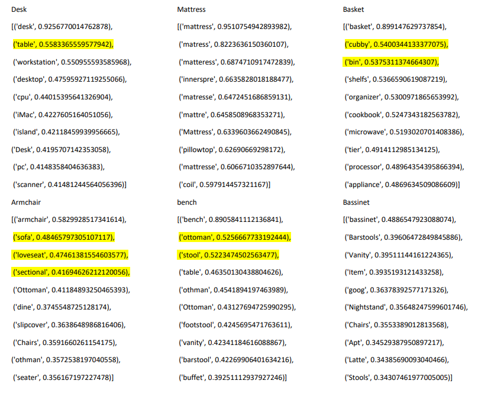

# Linking NLP and Vision
Natural language vocabulary consists of two types of words: concrete words and abstract words. If we are supposed to provide the word embedding vectors, we need to consider their nature. Although abstract words are intangible, they have well defined meaning acompannyng the other words. Thus, their representation can be obtained by distributional semantic word vectors.
However, the physical objects as concrete words do not convey any specific meaning and are remembered through their visual concepts. When we make a sentence with “tree”, we imagine a tree with trunk, branches, and green leaves. This called visual memory. The main goal of this project is to employ a pre-trained convolutional neural network (CNN) for concrete words (e.g., furniture) and use their visual features to present a new representation for components and subcomponents embedding vectors. The network is a fine-tuned ResNet18 which classifies the furniture stuff. This size of network would be appropriate compared to the size of dataset -We
have 6 classes of furniture and 15 subclasses- and the units of layers recognize them. First, the units related to the classes and sub-classes must be realized, and second they must be combined to provide embedding vectors containing the visual features. One instance of the proposed model is depicted below. The results include the distance between their embeddings and comparison between them.

There are 2 different parts in my project: image processing and text parsing analyzing. First, we train the network on a labeled image dataset to provide the visual embedding vectors. I have generated the images and segmented sub-components and labels using Unity. The image
dataset is located on Releases. Second, we fine-tune a pre-trained CNN for concrete words (e.g., furniture) in “model_testing2.py”. Then, the model checkpoints will be
uploaded to “model_loader.py”. Associated units with each concept is recognized in “tally_job_image” function located in “feature_operation.py”. For each image in test image dataset, it prints out the activated unit for the existing labels. The results of this part need to be enhanced and evaluated for the future explorations.
On the other hand, we use PoS tagging and Skip-gram to provide their textual embedding vectors. The reason I applied PoS tagging for texts pre-processing is that It is believed that the furniture stuff would be utilized by the similar action verbs (affordances). We use the furniture reviews in Amazon. The code is written in “skipGramFurniture.py”. The results are below:

The results show the cosine similarity between the individual word with a list of similar words. Three analyses are left for future. Why is the cosine similarity of a word with itself less than one? How different numbers of similar words could be chosen for a word? (e.g., 3 for armchair, 0 for mattress). What happen if semantic role labeling is applied instead of PoS tagging for preprocessing?
